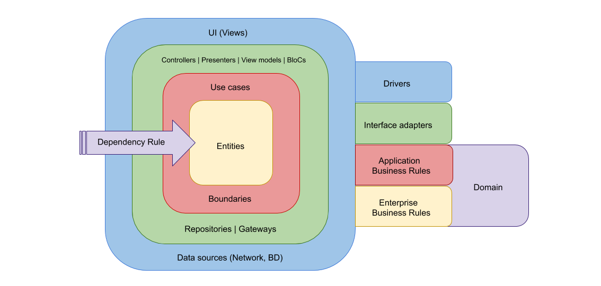

# Project Architect & Design

I decided to implement the solution in REST API; using C# ASP.NET Core Web API.
## Design principle
Using Clean Architecture principle, is a good way to separate business logic apart from application logic which we can adapt any application layers without the need to change or modify business logic.


## Setup Instruction
```shell
  git clone <repository>
```
Set startup project as `AmadeusAirConnection.API`
Click Start Debugging
The project should build successfully and redirect to Swagger UI.

## Test Instruction
In Visual Studio
Click Debug > Run Unit Tests
